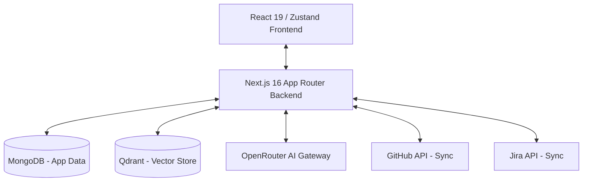

# AI-Powered Project Management Platform (APMP)

APMP is an intelligent, next-generation project management platform designed to automate and optimize the software development lifecycle (SDLC). By bridging requirements engineering, automated agile planning, and external platform integration, APMP acts as an AI co-pilot for product managers and engineering teams.

---

## 👁️ Project Vision

Traditional software planning requires tedious manual effort to translate high-level requirements into execution plans and estimate tasks. **APMP automates this transition** through:
1. **Requirements Ingestion:** Reading requirements (PDFs, text) and maintaining a centralized "Source of Truth" (SOT).
2. **Hierarchical WBS Decomposition:** Decomposing complex requirements specs into structured WBS trees (Epics → User Stories → Tasks → Subtasks) using advanced LLMs via OpenRouter.
3. **RAG-Driven Estimation:** Estimating story points for tasks using Retrieval-Augmented Generation (RAG) by fetching contextually similar historical issues stored in a **Qdrant vector database**.
4. **Bidirectional Syncing:** Seamlessly exporting planned backlogs and tracking issues to **Jira** and **GitHub** using secure OAuth channels.

---

## 🏗️ System Architecture

APMP is built using a modern, scalable, and secure full-stack architecture.



### 1. Frontend Layer
* **Framework:** Next.js 16 (App Router) & React 19.
* **Styling:** TailwindCSS v4 for fluid, high-performance responsive styling.
* **State Management:** Zustand (`projectStore.ts`) for clean, reactive, and global application state.
* **Iconography:** Lucide Icons.

### 2. Backend Services Layer
* **API Endpoints:** Serverless route handlers under `app/api/`.
* **Security & Authentication:** Custom JSON Web Token (JWT) verification middleware (`authMiddleware.ts`).
* **Encryption Service:** Secure storage of Jira and GitHub access tokens using AES-GCM encryption (`encryption.ts`).

### 3. Database & Vector Search
* **Primary Database:** MongoDB with Mongoose (`mongoose`) for structured storage of users, projects, SOT requirements, and WBS items.
* **Vector Store:** Qdrant DB for semantic indexing and vector-search retrieval of past issues (`QdrantService.ts`).
* **RAG Engine:** Estimation service (`EstimationService.ts`) querying Qdrant to find similar tasks and compute context-aware story point predictions.

### 4. AI Gateway
* **Gateway:** OpenRouter API Gateway integration (`OpenRouterGatewayProvider.ts`) offering unified access to multiple state-of-the-art LLMs.

---

## 📁 Project Documentation (`docs/`)

The repository includes a comprehensive set of design and requirements documentation to align the development team:

* 📄 **[Project Vision Document.docx]:** Details the platform's vision, objectives, core value propositions, target audience, and scope.
* 📄 **[Tai lieu yeu cau phan mem SRS.docx]:** Software Requirements Specification defining all functional, non-functional, and system constraint requirements (in Vietnamese).
* 📄 **[Tai lieu thiet ke phan mem SDD.docx]:** Software Design Document outlining system modeling, database schemas, and architectural patterns (in Vietnamese).
* 📄 **[De cuong Project GR1.docx]:** General outline and milestones for the GR1 project scope.
* 📊 **[User story.xlsx]:** Excel backlog sheet detailing user scenarios, acceptance criteria, and mapping matrices.

---

## 🚀 Getting Started

### Prerequisites
* **Node.js** (v18+)
* **MongoDB** (running locally or via Atlas)
* **Qdrant DB** (running locally via Docker or a cloud instance)

### Environment Setup
Create a `.env.local` file in the root directory:
```env
# MongoDB Connection
MONGODB_URI=mongodb://localhost:25017/apmp

# JWT Configuration
JWT_SECRET=your_jwt_secret_here

# Encryption Key (32-byte hexadecimal key for OAuth token storage)
ENCRYPTION_KEY=your_aes_encryption_key_here

# OpenRouter Configuration
OPENROUTER_API_KEY=your_openrouter_api_key_here

# Qdrant Vector DB Configuration
QDRANT_URL=http://localhost:6333
QDRANT_API_KEY=your_qdrant_api_key_here # Optional
```

### Installation
```bash
# Install dependencies
npm install

# Seed initial database data (users/projects)
npm run seed

# Run the development server
npm run dev
```

### Running Tests
Unit and integration tests are powered by **Vitest**:
```bash
# Run all test suites
npm run test

# Run tests in watch mode
npm run test:watch
```
